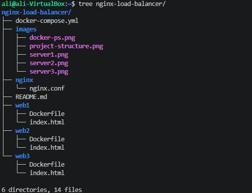
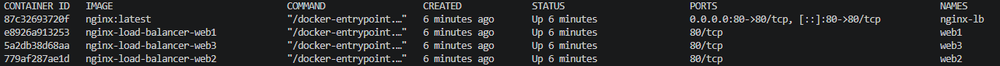
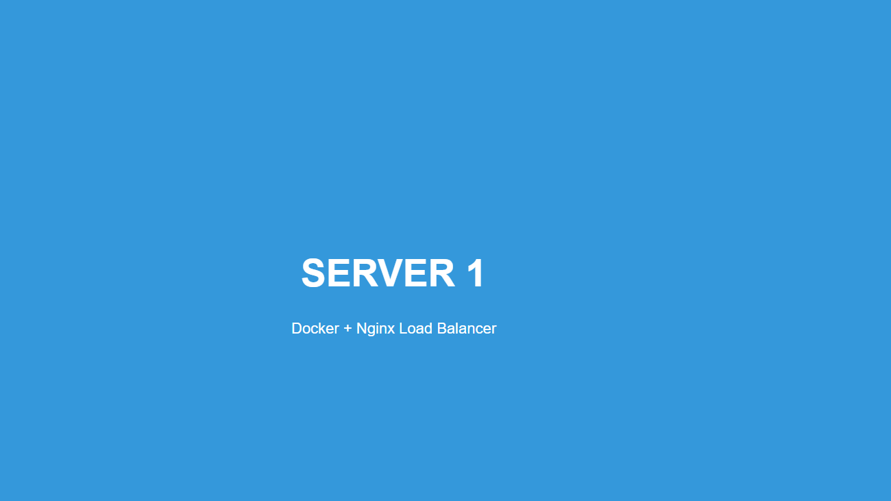
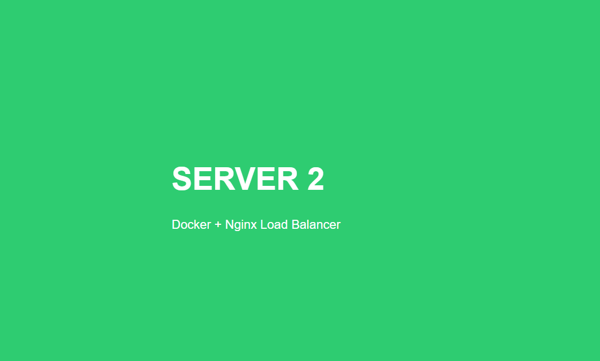
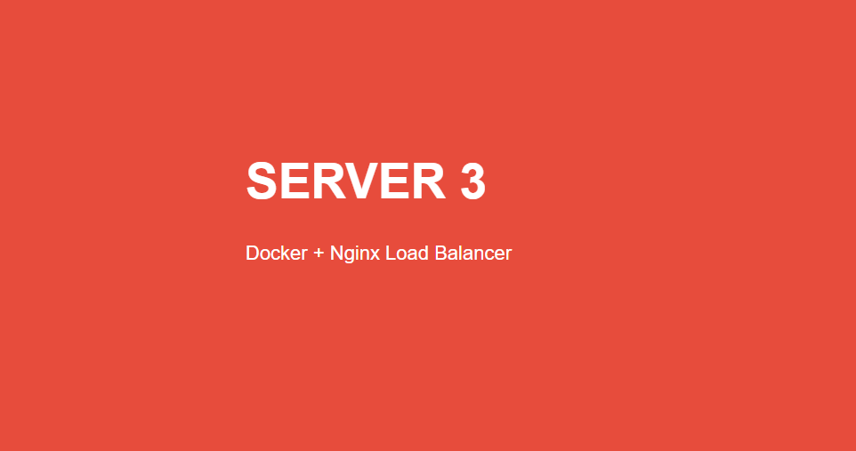

# 🚀 Docker Nginx Load Balancer Lab

A simple Docker project demonstrating **Nginx as a Load Balancer** with **three independent web server containers**.

---

# 📌 Project Overview

This project demonstrates how **Nginx** distributes incoming requests across multiple backend web server containers using the **Round Robin** load balancing algorithm.

---

# 📐 Architecture

```text
                 Client
                    │
          http://localhost
                    │
          +------------------+
          |   Nginx (LB)     |
          +------------------+
            │      │      │
            │      │      │
         Web1    Web2    Web3
```

---

# 📁 Project Structure

```text
nginx-load-balancer/
│
├── docker-compose.yml
├── README.md
│
├── images/
│   ├── docker-ps.png
│   ├── project-structure.png
│   ├── server1.png
│   ├── server2.png
│   └── server3.png
│
├── nginx/
│   └── nginx.conf
│
├── web1/
│   ├── Dockerfile
│   └── index.html
│
├── web2/
│   ├── Dockerfile
│   └── index.html
│
└── web3/
    ├── Dockerfile
    └── index.html
```

---

# ⚙️ Technologies Used

- Docker
- Docker Compose
- Nginx
- HTML
- CSS

---

# 🔄 Workflow

1. User sends a request to `http://localhost`
2. Nginx receives the request.
3. Nginx forwards the request to one of the backend containers.
4. Backend container processes the request.
5. Response is returned to the user.

```text
Client
   │
   ▼
Nginx
 │ │ │
 ▼ ▼ ▼
Web1 Web2 Web3
```

---

# 🚀 Getting Started

## Clone Repository

```bash
git clone https://github.com/your-username/nginx-load-balancer.git

cd nginx-load-balancer
```

---

## Build Docker Images

```bash
docker compose build
```

---

## Run Containers

```bash
docker compose up -d
```

---

## Verify Running Containers

```bash
docker ps
```

Expected Output

```text
nginx-lb
web1
web2
web3
```

---

# 🌐 Access Application

Open your browser:

```
http://localhost
```

Refresh the page multiple times to observe requests being served by different backend servers.

---

## 📁 Project Structure



---

## 🐳 Running Containers



---

## 🌐 Server 1



---

## 🌐 Server 2



---

## 🌐 Server 3



# 📚 Docker Commands Used

## Build Images

```bash
docker compose build
```

## Start Containers

```bash
docker compose up -d
```

## Stop Containers

```bash
docker compose down
```

## Rebuild Images

```bash
docker compose up --build
```

## View Logs

```bash
docker compose logs
```

## View Container Logs

```bash
docker logs nginx-lb
```

---

# 🔍 Troubleshooting

## Default Nginx Welcome Page Appears

**Reason**

The Docker image was not rebuilt after modifying the application.

**Solution**

```bash
docker compose down

docker compose build --no-cache

docker compose up -d
```

---

## Container Not Running

Verify all containers are running:

```bash
docker ps
```

---

# 📖 Concepts Covered

- Docker Containers
- Docker Images
- Docker Compose
- Docker Networking
- Nginx Reverse Proxy
- Load Balancing
- Round Robin Algorithm
- Port Mapping
- Container Communication

---

# 🎯 Learning Outcomes

After completing this lab, you will be able to:

- Create Docker images
- Run multiple containers
- Configure Docker Compose
- Understand Docker networking
- Configure Nginx as a Reverse Proxy
- Implement Round Robin Load Balancing
- Test communication between containers

---

# 👨‍💻 Author

**Mohd Fahad Khan**

GitHub: https://github.com/fahadkh14

---

⭐ If you found this project useful, don't forget to star the repository.
