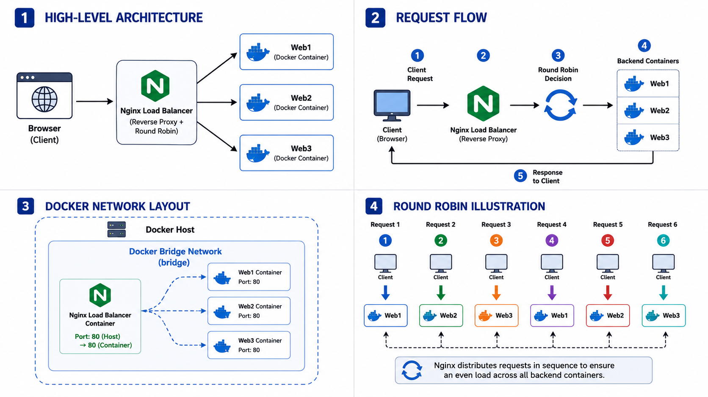

# 🚀 Docker Nginx Load Balancer Lab

A simple Docker project demonstrating **Nginx as a Load Balancer** with **three independent web server containers**. The project showcases how incoming client requests are distributed across multiple backend servers using the **Round Robin** load balancing algorithm.

---

# 📌 Project Overview

This project demonstrates how **Nginx** acts as a **Reverse Proxy** and **Load Balancer** for multiple Docker containers.

Instead of sending every client request to a single server, Nginx distributes the requests evenly across three backend web servers, improving scalability and availability.

---

# 🏗️ Architecture



---

# 🔄 What is Round Robin?

**Round Robin** is one of the simplest and most widely used load balancing algorithms.

It distributes incoming client requests **sequentially** across all available backend servers.

Instead of sending every request to the same server, Nginx forwards each new request to the next server in the list, ensuring that the workload is shared equally.

## Example

| Request | Backend Server |
|----------|----------------|
| Request 1 | Web1 |
| Request 2 | Web2 |
| Request 3 | Web3 |
| Request 4 | Web1 |
| Request 5 | Web2 |
| Request 6 | Web3 |

### Request Flow

```text
Client Requests

Request 1 ─────► Web1
Request 2 ─────► Web2
Request 3 ─────► Web3
Request 4 ─────► Web1
Request 5 ─────► Web2
Request 6 ─────► Web3
```

## Advantages

- ⚖️ Evenly distributes incoming traffic
- 🚀 Improves application performance
- 📈 Makes scaling easier
- 🔄 Prevents a single server from becoming overloaded
- 🛠️ Simple and efficient algorithm

---

# 📁 Project Structure

```text
nginx-load-balancer/
│
├── docker-compose.yml
├── README.md
│
├── images/
│   ├── architecture.png
│   ├── docker-ps.png
│   ├── project-structure.png
│   ├── server1.png
│   ├── server2.png
│   └── server3.png
│
├── nginx/
│   └── nginx.conf
│
├── web1/
│   ├── Dockerfile
│   └── index.html
│
├── web2/
│   ├── Dockerfile
│   └── index.html
│
└── web3/
    ├── Dockerfile
    └── index.html
```

---

# ⚙️ Technologies Used

- Docker
- Docker Compose
- Nginx
- HTML5
- CSS3

---

# 🔄 Workflow

1. Client sends a request to **http://localhost**
2. Nginx receives the request.
3. Nginx applies the Round Robin algorithm.
4. Request is forwarded to one of the backend containers.
5. Backend processes the request.
6. Response is returned to the client.

```text
              Client
                 │
                 ▼
        Nginx Load Balancer
                 │
      ┌──────────┼──────────┐
      ▼          ▼          ▼
    Web1       Web2       Web3
```

---

# 🚀 Getting Started

## Clone Repository

```bash
git clone https://github.com/fahadkh14/nginx-load-balancer.git

cd nginx-load-balancer
```

---

## Build Docker Images

```bash
docker compose build
```

---

## Run Containers

```bash
docker compose up -d
```

---

## Verify Running Containers

```bash
docker ps
```

Expected Output

```text
CONTAINER ID   IMAGE     STATUS

nginx-lb
web1
web2
web3
```

---

# 🌐 Access Application

Open your browser:

```
http://localhost
```

Refresh the page multiple times to observe requests being served by different backend servers.

---

# 📸 Screenshots

## 📁 Project Structure


---

## 🐳 Running Containers


---

## 🌐 Server 1


---

## 🌐 Server 2


---

## 🌐 Server 3


---

# 📚 Docker Commands Used

## Build Images

```bash
docker compose build
```

## Start Containers

```bash
docker compose up -d
```

## Stop Containers

```bash
docker compose down
```

## Rebuild Images

```bash
docker compose up --build
```

## View Logs

```bash
docker compose logs
```

## View Container Logs

```bash
docker logs nginx-lb
```

---

# 🔍 Troubleshooting

## Default Nginx Welcome Page Appears

### Reason

Docker image was not rebuilt after modifying the application.

### Solution

```bash
docker compose down

docker compose build --no-cache

docker compose up -d
```

---

## Containers Are Not Running

Check container status:

```bash
docker ps
```

Restart if necessary:

```bash
docker compose up -d
```

---

# 📖 Concepts Covered

- Docker Images
- Docker Containers
- Docker Compose
- Docker Networking
- Docker Bridge Network
- Nginx Reverse Proxy
- Nginx Load Balancing
- Round Robin Algorithm
- Container Communication

---

# 🎯 Learning Outcomes

After completing this project, you will understand how to:

- Build Docker images
- Run multiple Docker containers
- Configure Docker Compose
- Configure Nginx as a Reverse Proxy
- Configure Nginx as a Load Balancer
- Implement the Round Robin algorithm
- Understand Docker networking
- Enable communication between containers
- Build a simple production-style multi-container architecture

---

# 🚀 Future Improvements

- Add a custom Docker network
- Configure HTTPS with SSL certificates
- Implement Health Checks
- Add Docker Volumes
- Integrate Prometheus & Grafana Monitoring
- Deploy the project on Kubernetes
- Configure Nginx Ingress Controller
- Automate deployment using GitHub Actions

---

# 👨‍💻 Author

**Mohd Fahad Khan**

🔗 GitHub: https://github.com/fahadkh14

---

## ⭐ Support

If you found this project helpful:

- ⭐ Star this repository
- 🍴 Fork the repository
- 💡 Share your feedback
- 🚀 Happy Learning!